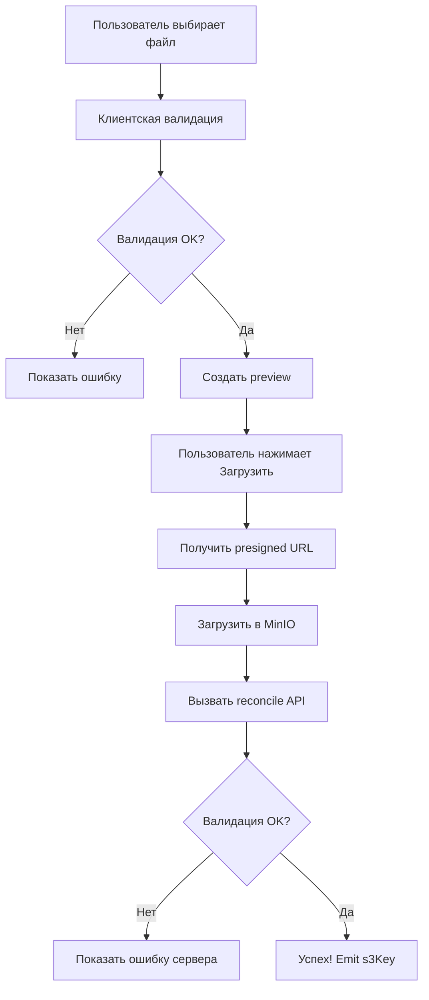

# 📸 Руководство по загрузке и отображению аватаров

Этот документ описывает реализованную функциональность загрузки аватаров для студентов и сотрудников.

## 📋 Реализованные компоненты

### 1. **Environment Configuration** (`src/environments/`)
Конфигурация imgproxy и MinIO:
```typescript
environment.imgproxy.url     // URL imgproxy сервера
environment.imgproxy.key     // Ключ для подписи URL
environment.imgproxy.salt    // Salt для подписи URL
environment.minio.url        // URL MinIO сервера
environment.upload.*         // Лимиты загрузки файлов
```

### 2. **MediaService** (`src/app/core/services/media.service.ts`)
Сервис для работы с API загрузки:
- `getPresignedUrl(request)` - получение presigned URL для загрузки
- `reconcile(key)` - валидация загруженного файла
- `uploadToMinio(url, file, contentType, onProgress)` - загрузка в MinIO

### 3. **ImgproxyService** (`src/app/core/services/imgproxy.service.ts`)
Сервис для генерации подписанных imgproxy URL:
- `signedUrl(s3Key, options)` - генерация URL с опциями
- `presetUrl(s3Key, preset)` - генерация URL с предустановками
- Presets: `thumbnail`, `avatar`, `avatarSmall`, `avatarLarge`, `card`, `large`

### 4. **ImgproxyPipe** (`src/app/shared/pipes/imgproxy.pipe.ts`)
Pipe для использования в шаблонах:
```html
<!-- Базовое использование -->


<!-- С опциями -->


<!-- С пресетом -->

```

### 5. **LazyImageDirective** (`src/app/shared/directives/lazy-image.directive.ts`)
Директива для lazy loading изображений:
```html

```

### 6. **UploadAvatarComponent** (`src/app/shared/components/upload-avatar/`)
Полнофункциональный компонент загрузки:
```html
<app-upload-avatar
  [userId]="user.id"
  [currentAvatarKey]="user.photoKey"
  [size]="'medium'"
  (uploadSuccess)="onAvatarUploaded($event)"
  (uploadError)="onAvatarError($event)"
></app-upload-avatar>
```

**Возможности:**
- ✅ Выбор файла через UI
- ✅ Клиентская валидация (тип, размер, разрешение)
- ✅ Предпросмотр изображения
- ✅ Прогресс загрузки
- ✅ Автоматическая загрузка через presigned URL
- ✅ Серверная валидация (reconcile)
- ✅ Обработка ошибок

**Валидация:**
- Форматы: JPEG, PNG, WebP
- Размер: до 5 МБ
- Разрешение: 256×256 - 4000×4000 пикселей
- Только статические изображения

## 🚀 Примеры использования

### Пример 1: Добавить компонент загрузки в форму

```typescript
// В компоненте формы
import { UploadAvatarComponent } from '@shared/components/upload-avatar/upload-avatar.component';

@Component({
  imports: [
    // ... другие импорты
    UploadAvatarComponent
  ]
})
export class UserEditComponent {
  userForm = this.fb.group({
    fullName: [''],
    email: [''],
    photoKey: ['']  // Добавить поле для S3 ключа
  });

  onAvatarUploaded(s3Key: string) {
    this.userForm.patchValue({ photoKey: s3Key });
    console.log('Avatar uploaded:', s3Key);
  }

  onAvatarError(error: string) {
    console.error('Upload error:', error);
  }
}
```

```html
<!-- В шаблоне формы -->
<form [formGroup]="userForm">
  <mat-form-field>
    <input matInput formControlName="fullName" placeholder="Full Name" />
  </mat-form-field>

  <app-upload-avatar
    [userId]="userId"
    [currentAvatarKey]="userForm.get('photoKey')?.value"
    (uploadSuccess)="onAvatarUploaded($event)"
    (uploadError)="onAvatarError($event)"
  ></app-upload-avatar>

  <button type="submit">Save</button>
</form>
```

### Пример 2: Отображение аватара в карточке

```typescript
import { ImgproxyPipe } from '@shared/pipes/imgproxy.pipe';

@Component({
  imports: [ImgproxyPipe]
})
export class UserCardComponent {
  user = {
    id: '123',
    fullName: 'John Doe',
    photoKey: 'users/123/photos/avatar.jpg'
  };
}
```

```html
<mat-card>
  <mat-card-header>
    
    <mat-card-title>{{ user.fullName }}</mat-card-title>
  </mat-card-header>
</mat-card>
```

### Пример 3: Использование разных размеров

```html
<!-- Маленький аватар (100x100) -->


<!-- Средний аватар (256x256) -->


<!-- Большой аватар (512x512) -->


<!-- Кастомный размер -->

```

### Пример 4: Использование LazyImageDirective

```html

```

## 🔄 Поток загрузки файла



## 🎨 Интеграция в существующие компоненты

### StudentCardComponent
Уже интегрировано:
- Отображение аватара в заголовке карточки
- Использование preset `'avatar'` (256x256, webp)
- Fallback на default-avatar.svg

### StaffCardComponent
Уже интегрировано:
- Отображение аватара в заголовке карточки
- Использование preset `'avatar'` (256x256, webp)
- Fallback на default-avatar.svg

## 📝 Backend Requirements

Для работы функциональности backend должен предоставлять:

### 1. POST `/api/media/presign/photo`
```json
// Request
{
  "userId": "uuid",
  "contentType": "image/jpeg",
  "filename": "avatar.jpg"
}

// Response
{
  "url": "presigned-url",
  "key": "s3-key",
  "fields": {},
  "mediaObjectId": "uuid"
}
```

### 2. POST `/api/media/reconcile?key={s3_key}`
```json
// Response
{
  "success": true,
  "key": "s3-key",
  "width": 300,
  "height": 300,
  "fileSize": 15423,
  "sha256": "hash",
  "reason": null
}
```

### 3. MinIO + imgproxy
- MinIO должен быть доступен на `http://localhost:9000`
- imgproxy должен быть доступен на `http://localhost:8081`
- Bucket: `aq-media` (private)

## 🧪 Тестирование

### Ручное тестирование

1. **Тест загрузки:**
   - Открыть форму пользователя
   - Выбрать изображение
   - Проверить preview
   - Нажать "Загрузить"
   - Убедиться что статус меняется: uploading → reconciling → success
   - Проверить что s3Key сохранился в форме

2. **Тест валидации:**
   - Попробовать загрузить файл > 5MB → должна быть ошибка
   - Попробовать загрузить .pdf → должна быть ошибка
   - Попробовать загрузить маленькое изображение (100x100) → должна быть ошибка
   - Попробовать загрузить огромное изображение (5000x5000) → должна быть ошибка

3. **Тест отображения:**
   - Открыть карточку студента с аватаром → должен показаться через imgproxy
   - Открыть карточку без аватара → должен показаться default-avatar.svg
   - Проверить что URL в DevTools содержит imgproxy signature

## 🐛 Troubleshooting

### Ошибка: "Imgproxy is not configured"
**Решение:** Проверить что в `environment.ts` заполнены:
- `imgproxy.url`
- `imgproxy.key`
- `imgproxy.salt`
- `minio.url`

### Ошибка: "Upload failed with status 403"
**Решение:** Проверить что presigned URL не истек и правильный

### Ошибка: "Network error during upload"
**Решение:** Проверить доступность MinIO на `http://localhost:9000`

### Изображение не отображается
**Решение:**
1. Проверить что imgproxy доступен на `http://localhost:8081`
2. Проверить signature (ключи должны совпадать с docker-compose)
3. Проверить что файл существует в S3
4. Открыть DevTools Network и посмотреть ответ imgproxy

## 📦 Зависимости

```json
{
  "dependencies": {
    "crypto-js": "^4.x.x"
  },
  "devDependencies": {
    "@types/crypto-js": "^4.x.x"
  }
}
```

## ✅ Checklist для Production

- [ ] Заменить imgproxy ключи в environment.prod.ts
- [ ] Настроить production URLs для MinIO и imgproxy
- [ ] Настроить CORS на MinIO
- [ ] Настроить CDN для imgproxy (опционально)
- [ ] Добавить мониторинг загрузок
- [ ] Настроить очистку неподтвержденных файлов (orphaned uploads)
- [ ] Добавить rate limiting для API загрузки

## 📚 Дополнительные материалы

- [imgproxy documentation](https://docs.imgproxy.net/)
- [MinIO JavaScript SDK](https://min.io/docs/minio/linux/developers/javascript/minio-javascript.html)
- [Angular HttpClient](https://angular.io/guide/http)
